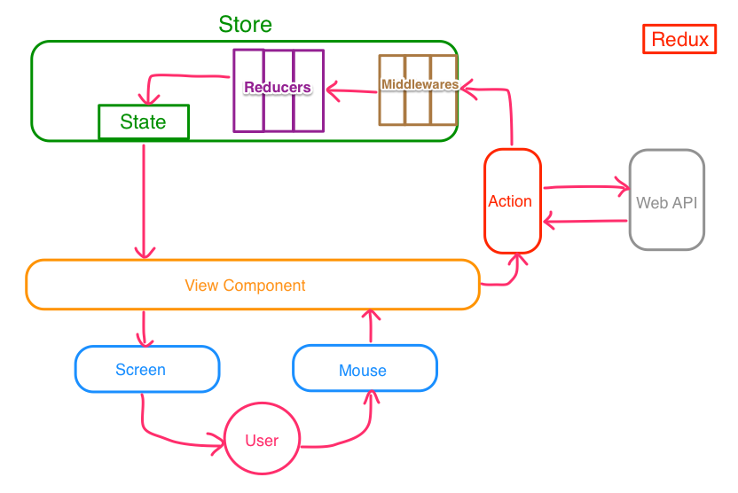

# Reduxの概要

- [Redux公式サイト](http://rackt.org/redux/index.html)
- [公式ドキュメント](http://redux.js.org/index.html)

## はじめに
初歩的な概念しか記載していませんが、以下の用語やデータフローは最低限理解しておきましょう。さらに理解を深めたい場合は公式ドキュメントを参照してください。

## Reduxの全体像


## 3原則
http://rackt.org/redux/docs/introduction/ThreePrinciples.html

|1.Single source of truth(ソースは1つだけ)|
|-|
|アプリケーション全体の状態(`state`)はツリーの形で1つのオブジェクトで作られ、1つのストアに保存される。`state`が保存しやすいので、ユニバーサルアプリケーションがつくりやすい。`state`が1つだから、デバッグしやすい、開発しやすい。|

|2.State is read-only(状態は読み取り専用)|
|-|
|状態を変更する手段は、変更内容をもったActionオブジェクトを発行して実行するだけ。ビューやコールバックが状態を直接変更させることはできない。変更は一つずつ順番に行なわれる。Actionはオブジェクトなので、保存可能であり、テストしやすい。|

|3.Mutations are written as pure functions(変更はすべてpureな関数で書かれる)|
|-|
|アクションがどのように状態を変更するかを`Reducer`で行う。`Reducer`は状態とアクションを受けて新しい状態を返す関数である。現在の`state`を変更することはせずに、新しい`state`オブジェクトを作って返すというのがポイント。最初はアプリケーションで一つの`Reducer`を用意して、巨大化してきたら`Reducer`を分割していく。|

## 用語

### Action
- アプリケーションからの情報を`store`へ送る為のオブジェクト
- `store.dispatch()`で`store`へ送られる
- 何を行なうものかを識別するために`type`プロパティを必ず持つ。この`type`を`ActionType`と呼ぶ。

```js
const ADD_TODO = 'ADD_TODO';
{
  type: ADD_TODO,
  text: 'Build my first Redux app'
};
```

### ActionCreator
Actionを作る関数です。

```js
function addTodo(text) {
  return {
    type: ADD_TODO,
    text: text
  };
}
```

`dispatch`するときは`creator`で作成した`action()`を渡します。

```
dispatch(addTodo(text));
```

### Store
**役割**
- `state`を保持する
- `state`へアクセスするための`getState()`を提供する
- `state`を更新するための`dispatch(action)`を提供する
- リスナーを登録するための`subscribe(listener)`を提供する

`store`は必ず1つのみ。`state`ごとにロジックを分割したい場合は、`store`を分割せずに`reducer composition`を使用してください。

`store`をつくるには、`combineReducer`でつくられた`reducer`を`createStore()`へ渡します。

```js
import { createStore } from 'redux';
import todoApp from './reducers';
const store = createStore(todoApp);
```

### Reducer
- 現在の`state`と`action`を受けて新しい`state`を返すだけの純粋なメソッドです。
 
```js
(previousState, action) => newState;
```

`reducer`の中で以下のことをやってはいけません
- 引数の`state`, `action`インスタンスの値を変更する
- 副作用を起こす(APIを呼んだり、ルーティングを変えるなどなど)
- 毎回値が変わるもの(`Date.now()`や`Math.random()`)を扱う

### Middleware
- `dispatch`する前後にそれぞれ任意の処理を追加することができる仕組み
- `dispatch`前後の`state`の状態をログ出力する等
- npmに有志によって実装されたMiddlewareが上がっているので適宜使用する https://www.npmjs.com/search?q=redux%20middleware

## データフロー
WIP

## 参考資料